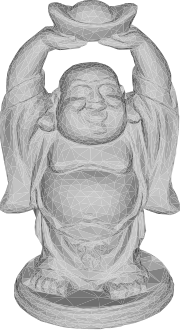

## Motivation
Normal integration reconstructs 3D surfaces from normal maps obtained e.g. by photometric stereo. These normal maps capture surface details down to the pixel level but require large computational resources for integration at high resolutions. In this work, we replace the dense pixel grid with a sparse anisotropic triangle mesh before normal integration. We adapt the triangle mesh to the local geometry in the case of complex surface structures and remove oversampling from flat featureless regions.
For high-resolution images, the resulting compression reduces normal integration runtimes from hours to minutes while maintaining high surface accuracy.
## Overview
Our algorithm iteratively refines an existing triangle mesh in screen space based on the observed surface normals from photometric stereo. We initialize this triangle mesh by covering each *foreground* pixel with two triangles. We then repeatedly

1. **Collapse Edges** that are inconsequential for the surface shape,
2. **Align Edges** with ridges and furrows of the underlying surface and
2. **Move Vertices** onto ridges and furrows.

The result is a triangle mesh that is much sparser than the original pixel grid and well-adapted to represent the underlying surface after normal integration. 
<div style="display: flex; justify-content: space-between;">
  <figure style="width: 30%; margin: 0; text-align: center;">
    
    <figcaption>Low Resolution</figcaption>
  </figure>
  <figure style="width: 30%; margin: 0; text-align: center;">
    
    <figcaption>Mid Resolution</figcaption>
  </figure>
  <figure style="width: 30%; margin: 0; text-align: center;">
    
    <figcaption>High Resolution</figcaption>
  </figure>
</div>
The sparsity is controlled either explicitly by setting a vertex budget or implicitly by setting a limit on the allowed deviation from the underlying surface.

## Result


Our results show that careful alignment of vertices and edges to ridges and furrows of the underlying surface is key to surpassing the quality of previous methods and maintaining high geometric faithfulness even at high compression ratios. Conversely, we achieve comparable results to pixel-based methods at moderate compression ratios. Our method is versatile and allows balancing runtime and quality. It can be adjusted to the needs of almost any photometric stereo pipeline. We included mesh files in the [supplementary material](https://drive.google.com/uc?export=download&id=1VaV_LrEw-LG2u2VpW7cDcjJjfyHCDcxh) to give an impression of the quality of our method.

## Citation

```
@InProceedings{Heep_2025_CVPR,
    author    = {Heep, Moritz and Behnke, Sven and Zell, Eduard},
    title     = {Feature-Preserving Mesh Decimation for Normal Integration},
    booktitle = {Proceedings of the Computer Vision and Pattern Recognition Conference (CVPR)},
    month     = {June},
    year      = {2025},
    pages     = {5783-5792}
}
```
